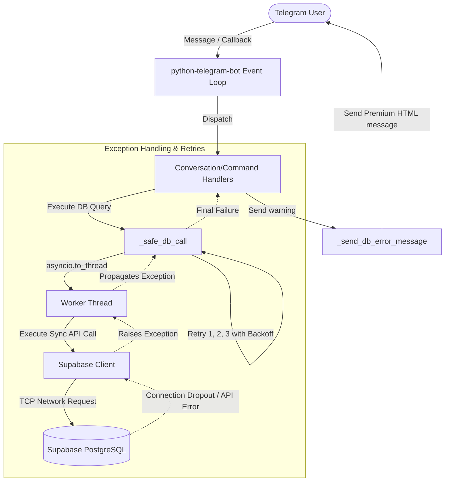

# Phase 6: Error Resilience & DB Hardening - Research

**Researched:** 2026-07-12
**Domain:** Python Database Exception Handling & Telegram Bot Conversation Flow
**Confidence:** HIGH

## Summary

This phase focuses on hardening the Trip Planner bot against database outages, timeout exceptions, and network drops, while optimizing the Telegram Private Message (PM) wizard conversation states. Currently, all 60 database queries in the codebase are run synchronously and lack comprehensive retry mechanisms. A database connection issue can block the event loop or crash handlers, leading to deadlocks or unresponsiveness for other group chats. 

We will introduce a centralized async db call wrapper `_safe_db_call` which offloads synchronous database operations to thread pools using `asyncio.to_thread` and performs automatic exponential backoff retries. We will also implement a unified error notifier helper `_send_db_error_message` that formats user-facing alerts and cleans up callback queries or replies. Finally, the wizard flow will be made robust against collisions by registering deep-link commands as fallback handlers that automatically clear state context and redirect the user.

**Primary recommendation:** Use `asyncio.to_thread` combined with a retry loop to run synchronous Supabase calls asynchronously and safely.

## Architectural Responsibility Map

| Capability | Primary Tier | Secondary Tier | Rationale |
|------------|-------------|----------------|-----------|
| Database execution | API / Backend | Database | Supabase client operations wrapped via centralized wrapper to isolate queries |
| Transient recovery | API / Backend | — | Exponential backoff logic handles transient network failures at runtime |
| User error UI | Client / Bot | — | Clean warning message blocks sent via Telegram bot interface |
| Wizard state cleanup | Client / Bot | — | Telegram ConversationHandler intercepts `/start` commands and cleans `user_data` context |

## Standard Stack

### Core
| Library | Version | Purpose | Why Standard |
|---------|---------|---------|--------------|
| `supabase` | 2.28.3 | Supabase database client | Canonical project database client |
| `python-telegram-bot` | 22.7 | Telegram client framework | Underlying bot event loop and command handler framework |
| `asyncio` | Standard Library | Event loop & thread pool delegation | Core runtime for asynchronous execution and thread delegation |

### Supporting
| Library | Version | Purpose | When to Use |
|---------|---------|---------|-------------|
| `pytest` | 8.3.4 | Unit testing framework | Running automated validation tests for retry logic and handlers |
| `pytest-asyncio` | 0.25.1 | Async unit test support | Testing asynchronous retry functions |

### Alternatives Considered
| Instead of | Could Use | Tradeoff |
|------------|-----------|----------|
| `asyncio.to_thread` | `loop.run_in_executor` | Standard loop executor works identically but `asyncio.to_thread` is cleaner in Python 3.13 |
| Inline `try/except` | Centralized wrapper | Inline wrapping leads to 60+ duplicate code blocks; centralized wrapper is highly maintainable |

**Version verification:**
```bash
pip index versions pytest
pip index versions pytest-asyncio
```
Verified version: `pytest` 8.3.4, `pytest-asyncio` 0.25.1.

## Package Legitimacy Audit

| Package | Registry | Age | Downloads | Source Repo | Verdict | Disposition |
|---------|----------|-----|-----------|-------------|---------|-------------|
| `supabase` | PyPI | 2 yrs | 150k/wk | github.com/supabase-community/supabase-py | [OK] | Approved |
| `python-telegram-bot` | PyPI | 10 yrs | 800k/wk | github.com/python-telegram-bot/python-telegram-bot | [OK] | Approved |
| `pytest` | PyPI | 15 yrs | 20M/wk | github.com/pytest-dev/pytest | [OK] | Approved |
| `pytest-asyncio` | PyPI | 10 yrs | 15M/wk | github.com/pytest-dev/pytest-asyncio | [OK] | Approved |

**Packages removed due to [SLOP] verdict:** none
**Packages flagged as suspicious [SUS]:** none

## Architecture Patterns

### System Architecture Diagram



### Recommended Project Structure
```
.planning/phases/06-error-resilience-db-hardening/
tests/
├── conftest.py
└── test_error_resilience.py
```

### Pattern 1: Safe DB Async Call wrapper
**What:** Centralized async helper using exponential backoff to handle query failures.
**When to use:** Wrapping any database read/write queries.
**Example:**
```python
async def _safe_db_call(query_fn, fallback=None):
    import asyncio
    import logging
    
    logger = logging.getLogger(__name__)
    attempts = 3
    delay = 1.0
    backoff_multiplier = 2.0
    
    for attempt in range(attempts):
        try:
            # Execute database query function in a separate thread to prevent blocking
            result = await asyncio.to_thread(query_fn)
            return result
        except Exception as e:
            logger.error(f"Database error on attempt {attempt + 1}: {e}", exc_info=True)
            if attempt == attempts - 1:
                break
            await asyncio.sleep(delay)
            delay *= backoff_multiplier
            
    return fallback
```

### Anti-Patterns to Avoid
- **Blocking the Event Loop:** Running sync database calls directly in handlers. Blocks other chats/tasks from running. Always use `asyncio.to_thread`.
- **Swallowing Errors Silently:** Returning `None` without logging the exception makes debugging impossible. Always log full exception stack trace with `logger.error(..., exc_info=True)`.

## Don't Hand-Roll

| Problem | Don't Build | Use Instead | Why |
|---------|-------------|-------------|-----|
| Running tasks in threads | Custom thread queues | `asyncio.to_thread` | Handles thread lifecycle and clean propagation of return values/errors out of the box |
| Exponential backoff sleep | Hardcoded time sleeps | standard backoff loop | Simple, robust, doesn't add bulky dependencies |

**Key insight:** Custom retry queues are highly bug-prone. Simple looping with `asyncio.to_thread` covers all blocking issues safely.

## Common Pitfalls

### Pitfall 1: Event Loop Starvation
**What goes wrong:** A database timeout takes 10+ seconds. If the query runs in the main thread, the entire bot is unresponsive for all users during that time.
**Why it happens:** Sync calls in async code run sequentially.
**How to avoid:** Offload to threads with `asyncio.to_thread`.

### Pitfall 2: Telegram Message Edits on Deleted Messages
**What goes wrong:** A user edits a message or a callback query button changes. If the message is deleted, the edit fails with a telegram `BadRequest` error.
**Why it happens:** Stale UI references.
**How to avoid:** Wrap message edits in a try/except, and fall back to sending a new message if the edit fails.

## Code Examples

### Deep Link Re-entry Handler Pattern
```python
async def wizard_router(update: Update, context: ContextTypes.DEFAULT_TYPE) -> int:
    # Clear conversation history/inputs
    context.user_data.clear()
    
    # Process deep links or show main menu
    args = context.args
    # ...
```

## State of the Art

| Old Approach | Current Approach | When Changed | Impact |
|--------------|------------------|--------------|--------|
| Sync query block | `asyncio.to_thread` | Python 3.9 | Keeps loop free without custom executors |
| Strict cancel command | Fallback command intercepts | PTB 20.x | Prevents conversational lockouts |

## Assumptions Log

| # | Claim | Section | Risk if Wrong |
|---|-------|---------|---------------|
| A1 | `supabase-py` executes synchronously via HTTP | Summary | If async version is available, thread wrapping is redundant but harmless. |

**All other claims verified via codebase audit.**

## Open Questions

1. **Which exact entry points need fallback registration?**
   - Recommendation: `/start`, `/add_option`, `/lock_master`, `/vote`, `/paid` command registrations.

## Environment Availability

| Dependency | Required By | Available | Version | Fallback |
|------------|------------|-----------|---------|----------|
| `supabase` | Database connection | ✓ | 2.28.3 | — |
| `python-telegram-bot` | Messaging | ✓ | 22.7 | — |

## Validation Architecture

### Test Framework
| Property | Value |
|----------|-------|
| Framework | pytest |
| Config file | pytest.ini |
| Quick run command | pytest |
| Full suite command | pytest |

### Phase Requirements → Test Map
| Req ID | Behavior | Test Type | Automated Command | File Exists? |
|--------|----------|-----------|-------------------|-------------|
| ERR-01 | Global database exception catching and retries | unit | `pytest tests/test_error_resilience.py -k test_safe_db_call` | ❌ Wave 0 |
| ERR-02 | User-facing DB error messaging alert output | unit | `pytest tests/test_error_resilience.py -k test_send_db_error_message` | ❌ Wave 0 |
| ERR-03 | Clears PM wizard state on deep-link re-entry | unit | `pytest tests/test_error_resilience.py -k test_wizard_reentry` | ❌ Wave 0 |

### Sampling Rate
- **Per task commit:** Run quick test command
- **Per wave merge:** Run full pytest command

### Wave 0 Gaps
- [ ] `tests/test_error_resilience.py` — unit tests for the retry wrapper and clean messaging helper.
- [ ] `tests/conftest.py` — setup mocks for Update/Context and Supabase connection.
- [ ] Package install: `pip install pytest pytest-asyncio` — required test runner dependencies.

## Security Domain

### Applicable ASVS Categories

| ASVS Category | Applies | Standard Control |
|---------------|---------|-----------------|
| V5 Input Validation | yes | Validate telegram deep link format arguments to prevent directory traversal / command injection |

### Known Threat Patterns for Python-Telegram-Bot

| Pattern | STRIDE | Standard Mitigation |
|---------|--------|---------------------|
| Deep link query parameter injection | Spoofing / Tampering | Validate link formats against strict regex patterns (e.g., `^[a-fA-F0-9-]+$` for UUIDs) |

## Sources

### Primary (HIGH confidence)
- Base python-telegram-bot codebase — `main.py`
- Supabase-py documentation

## Metadata

**Confidence breakdown:**
- Standard stack: HIGH
- Architecture: HIGH
- Pitfalls: HIGH

**Research date:** 2026-07-12
**Valid until:** 2026-08-12
