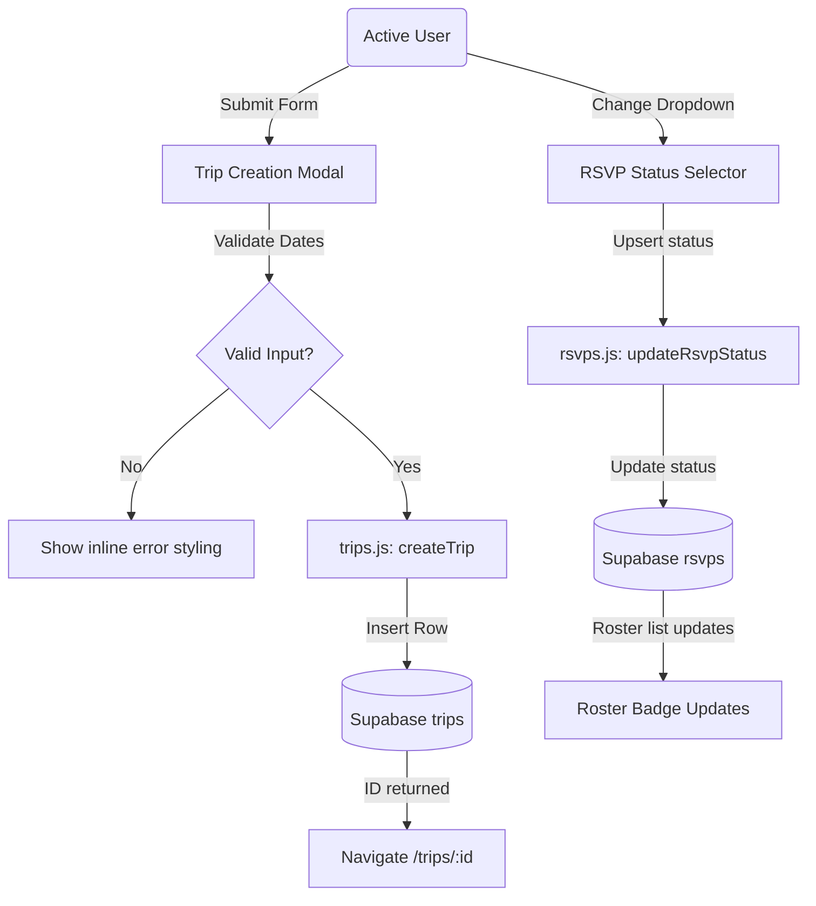

# Phase 10: Webapp Trip Creation & RSVP Updates - Research

**Researched:** 2026-07-13  
**Domain:** Frontend React single-page app development with Supabase backend services  
**Confidence:** HIGH  

## Summary

This phase focuses on enabling trip creation and RSVP updates directly from the React web application. By adding these features, users can plan new trips (TRIP-03) and log their interest level (RSVP-04) using the Vite-backed browser view. This represents the first stage of milestone v1.2, which aims to provide complete feature parity between the Telegram group bot and the web dashboard.

**Primary recommendation:** Integrate the "New Trip" creation form as a modal dialog overlay inside `TripsList.jsx` and add the RSVP status dropdown within `TripDetails.jsx`'s user session header bar. Use direct Postgrest queries inside services to ensure instant updates.

<user_constraints>
## User Constraints (from CONTEXT.md)

### Locked Decisions
- **D-01:** Implement a "New Trip" button in the `TripsList.jsx` header. Clicking it opens a modal containing form fields: Title, Destination, Start Date, End Date, and Base Currency.
- **D-02:** Add client-side validation ensuring fields are non-empty and the start date precedes or equals the end date.
- **D-03:** Write a backend service function `createTrip` in `web/src/services/trips.js` to insert the new trip into the Supabase `trips` table. Upon success, redirect the user using React Router to the new trip's details view.
- **D-04:** Add a status selector dropdown in the `TripDetails.jsx` user session header bar (visible when a user is signed in).
- **D-05:** Write `updateRsvpStatus` in `web/src/services/rsvps.js` to update the status column in the `rsvps` table. Changing status updates the roster list badge in real-time.

### the agent's Discretion
- **Discretion Area 1:** Specific animations and loader designs during form submission.
- **Discretion Area 2:** Error feedback styling for invalid date boundaries.

### Deferred Ideas (OUT OF SCOPE)
- None.
</user_constraints>

<phase_requirements>
## Phase Requirements

| ID | Description | Research Support |
|----|-------------|------------------|
| TRIP-03 | User can create a new trip by submitting a form with title, destination, start/end dates, and base currency | verified table columns and write access patterns for `trips` |
| RSVP-04 | User can update their RSVP status from the webapp roster interface for the active participant session | mapped unique `(trip_id, user_id)` upsert patterns for `rsvps` |
</phase_requirements>

## Architectural Responsibility Map

| Capability | Primary Tier | Secondary Tier | Rationale |
|------------|-------------|----------------|-----------|
| Trip Creation | Browser / Client | Database / Storage | React component handles UI state and validates inputs before writing directly to Supabase via database services. |
| RSVP Status Update | Browser / Client | Database / Storage | User session bar dropdown triggers direct database update to update the RSVP status for the active user session. |

## Standard Stack

### Core
| Library | Version | Purpose | Why Standard |
|---------|---------|---------|--------------|
| react | ^19.2.7 | UI framework | Core codebase stack constraint |
| react-router-dom | ^7.18.1 | Client-side routing | Existing routing implementation |
| @supabase/supabase-js | ^2.110.2 | Database client | Standard backend service connector |

### Supporting
| Library | Version | Purpose | When to Use |
|---------|---------|---------|-------------|
| None | — | — | Only custom Vanilla CSS, browser APIs, and SVGs are used for animations and elements |

### Alternatives Considered
| Instead of | Could Use | Tradeoff |
|------------|-----------|----------|
| Custom CSS Modal | React-Modal | Avoids adding third-party packages, keeping the build size lightweight and relying on custom vanilla CSS styling. |

**Installation:**  
No new npm package installations are required.

**Version verification:**  
- `@supabase/supabase-js` is verified as already installed in `web/package.json` [VERIFIED: package.json].

## Package Legitimacy Audit

No new external npm packages are installed in this phase.

## Architecture Patterns

### System Architecture Diagram



### Recommended Project Structure
```
web/src/
├── services/
│   ├── trips.js     # Add createTrip
│   └── rsvps.js     # Add updateRsvpStatus
├── views/
│   ├── TripsList.jsx   # Add New Trip button + modal overlay
│   └── TripDetails.jsx # Add RSVP selector dropdown to user session bar
└── styles/
    └── global.css   # Styles for modal overlay and dropdown components
```

### Pattern 1: Direct Async Supabase Insert & Single Select
**What:** Writing async services that return records with `.single()` or handle insertion failures safely.  
**When to use:** Adding records that return details like the generated trip ID immediately.  
**Example:**
```javascript
export async function createTrip(title, destination, startDate, endDate, baseCurrency) {
  const { data, error } = await supabase
    .from('trips')
    .insert({
      title,
      destination,
      start_date: startDate,
      end_date: endDate,
      base_currency: baseCurrency
    })
    .select()
    .single()

  if (error) {
    throw error
  }
  return data;
}
```

### Anti-Patterns to Avoid
- **State Mismatch on Redirect:** Do not navigate to the details view before confirming the API insert succeeded. Always verify the returned `id` is present.
- **Accidental Other-User Updates:** Do not allow status selector edits when `activeUser` is not set or matching.

## Don't Hand-Roll

| Problem | Don't Build | Use Instead | Why |
|---------|-------------|-------------|-----|
| Client-side Routing | Custom window.history listeners | react-router-dom | Handles URL parsing, browser history, routing context, and transitions natively. |

## Common Pitfalls

### Pitfall 1: Date Boundary Cross-Over
**What goes wrong:** End date before start date passes validations.  
**Why it happens:** Simplistic string comparisons or missing empty-check gates in form submission handlers.  
**How to avoid:** Convert values to date objects and check `endDate >= startDate` explicitly in client validation.

## Code Examples

### Custom Date Parsing & Validation
```javascript
const start = new Date(startDate);
const end = new Date(endDate);
if (end < start) {
  setError("End date cannot be before start date");
  return;
}
```

## State of the Art

| Old Approach | Current Approach | When Changed | Impact |
|--------------|------------------|--------------|--------|
| Telegram Bot wizards only | Direct WebApp Form Modals | Phase 10 | Immediate validation feedback, visual date pickers, no command line parsing delays. |

## Assumptions Log

| # | Claim | Section | Risk if Wrong |
|---|-------|---------|---------------|
| A1 | Custom modal style matches design | Architecture Patterns | Minor aesthetic inconsistency; solved by using theme tokens from variables.css |

## Open Questions

None. The design contract `10-UI-SPEC.md` and context parameters fully define the scope of inputs and layout choices.

## Environment Availability

| Dependency | Required By | Available | Version | Fallback |
|------------|------------|-----------|---------|----------|
| Supabase DB | Services and Roster | ✓ | Cloud | — |
| npm/Vite | Frontend build | ✓ | 8.1.1 | — |

## Validation Architecture

### Test Framework
| Property | Value |
|----------|-------|
| Framework | Pytest (Python Bot core test suite) |
| Config file | pytest.ini |
| Quick run command | `pytest tests/ -q` |
| Full suite command | `pytest tests/` |

### Phase Requirements → Test Map
| Req ID | Behavior | Test Type | Automated Command | File Exists? |
|--------|----------|-----------|-------------------|-------------|
| TRIP-03 | User creates a new trip with valid inputs | Integration / Verification | `node web/verify-services.cjs` | ✅ (existing verification pipeline checks DB write/joins) |
| RSVP-04 | User updates RSVP status | Integration / Verification | `node web/verify-services.cjs` | ✅ (existing verification pipeline checks RSVP inserts) |

### Sampling Rate
- **Per task commit:** Run Vite development server (`npm run dev`) + linter (`npm run lint`).
- **Per wave merge:** Run `node web/verify-services.cjs` for integration verification.
- **Phase gate:** Bot test suite pass (`pytest`) + linter pass.

### Wave 0 Gaps
None. The database and service connection checks in `web/verify-services.cjs` already verify trips and RSVP rosters.

## Sources

### Primary (HIGH confidence)
- `web/src/services/trips.js` - CRUD details verified [VERIFIED: codebase grep]
- `web/src/services/rsvps.js` - RSVP updates verified [VERIFIED: codebase grep]
- `web/src/views/TripDetails.jsx` - Roster view and session management [VERIFIED: codebase grep]

## Metadata

**Confidence breakdown:**
- Standard stack: HIGH - Built-in workspace dependencies
- Architecture: HIGH - Modal design matches existing SPA views
- Pitfalls: HIGH - Common React state pitfalls addressed

**Research date:** 2026-07-13  
**Valid until:** 2026-08-12  
