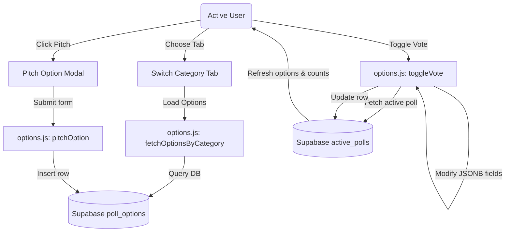

# Phase 11: Webapp Option Pitching & Voting - Research

**Researched:** 2026-07-13  
**Domain:** React Webapp Development with Supabase JSONB Voting Mechanics  
**Confidence:** HIGH  

## Summary

This phase implements option pitching and voting in the React web application, allowing users to suggest options (accommodation, activities, transport, etc.) and vote/unvote on them directly from the web interface. This bridges the options pitching functionality (PITCH-04) and voting casting/retracting logic (PITCH-05) from the Telegram bot to the web view.

**Primary recommendation:**
1. Create `web/src/services/options.js` to manage fetching and inserting rows in `poll_options`, querying `active_polls` for voting records, and handling the multi-option vote toggle operations.
2. Group options by category using a tabbed interface inside `TripDetails.jsx`.
3. Add a "Pitch Option" button in each tab that triggers a glassmorphic modal form.
4. Implement a toggle button on each option card to cast/retract votes, persisting them inside the `active_polls.voter_selections` and `active_polls.votes_by_option` JSONB columns.

<user_constraints>
## User Constraints (from CONTEXT.md)

### Locked Decisions
- **D-01:** Render pitched options grouped by categories (Accommodation, Flights, Activities, Food, Transport, Other) inside a tabbed interface. Tabs are aligned horizontally to switch active categories cleanly.
- **D-02:** When the active category tab has no options, display a premium empty state stating "No options pitched for this category yet." with a CTA to pitch one.
- **D-03:** Add a "Pitch Option" button visible in the active tab. Clicking it opens a glassmorphic form modal containing fields: Option Name/Title *, Estimated Cost (optional), Currency (optional dropdown), URL Link (optional), and Description (optional).
- **D-04:** Add client-side validations to ensure the Name field is filled and that cost is a valid positive number if provided.
- **D-05:** Submitting the form inserts a new row into the `poll_options` table and immediately refreshes the active category view.
- **D-06:** Support Multi-Option Voting—users can vote for multiple pitched options in a category.
- **D-07:** Since the database lacks a dedicated `votes` table, web votes will be persisted in the `active_polls` table.
  - For each trip and category, we query `active_polls`. If no entry exists, we create one with a null `telegram_poll_id`.
  - We store voter selections in the JSONB column `voter_selections` (mapping user UUID to an array of option IDs they voted for, e.g. `{"user-uuid-1": [12, 15]}`).
  - We aggregate totals in `votes_by_option` JSONB column (mapping option ID to total votes count, e.g. `{"12": 2, "15": 1}`) to fetch vote counts efficiently in a single query.
- **D-08:** Highlight option cards that the active signed-in user has voted for, and provide a toggle button to cast or retract votes.

### the agent's Discretion
- **Discretion Area 1:** Visual animations for category tab transitions.
- **Discretion Area 2:** Accent border overlays on voted option cards.

### Deferred Ideas (OUT OF SCOPE)
- None.
</user_constraints>

<phase_requirements>
## Phase Requirements

| ID | Description | Research Support |
|----|-------------|------------------|
| PITCH-04 | User can pitch a new trip option specifying category, title, optional price, currency, URL, and description. | Verified insertion fields against `poll_options` columns. |
| PITCH-05 | User can cast or retract their vote on any pitched option directly from the webapp. | Documented Supabase JSONB update patterns for `active_polls.voter_selections` and `active_polls.votes_by_option`. |
</phase_requirements>

## Architectural Responsibility Map

| Capability | Primary Tier | Secondary Tier | Rationale |
|------------|-------------|----------------|-----------|
| Option Pitching | Browser / Client | Database / Storage | React component handles UI state and validates inputs before writing directly to Supabase `poll_options` table. |
| Option Listing | Browser / Client | Database / Storage | Fetches rows from `poll_options` filterable by trip and category. |
| Multi-Option Voting | Browser / Client | Database / Storage | Toggles array values inside `active_polls` JSONB columns, recalculating and saving aggregates. |

## Standard Stack

### Core
| Library | Version | Purpose | Why Standard |
|---------|---------|---------|--------------|
| react | ^19.2.7 | UI framework | Core codebase stack constraint |
| @supabase/supabase-js | ^2.110.2 | Database client | Standard backend service connector |

### Supporting
| Library | Version | Purpose | When to Use |
|---------|---------|---------|-------------|
| None | — | — | Only custom Vanilla CSS, browser APIs, and SVGs are used for animations and elements |

**Installation:**  
No new npm package installations are required.

## Package Legitimacy Audit

No new external npm packages are installed in this phase.

## Architecture Patterns

### System Architecture Diagram



### Recommended Project Structure
```
web/src/
├── services/
│   ├── options.js     # [NEW] Add option pitching & voting service operations
```

## Proposed Solution & Service Functions

We will write `web/src/services/options.js` to expose four key functions:

### 1. `fetchOptions(tripId, category)`
Fetches pitched options from `poll_options` matching `tripId` and `category`.
```javascript
export async function fetchOptions(tripId, category) {
  const { data, error } = await supabase
    .from('poll_options')
    .select('*')
    .eq('trip_id', tripId)
    .eq('category', category.toLowerCase())
    .order('created_at', { ascending: true })

  if (error) throw error
  return data
}
```

### 2. `pitchOption(tripId, category, name, estimatedCost, currency, link, description, addedByUserId)`
Pitches an option for the trip.
```javascript
export async function pitchOption(tripId, category, name, estimatedCost, currency, link, description, addedByUserId) {
  const { data, error } = await supabase
    .from('poll_options')
    .insert({
      trip_id: tripId,
      category: category.toLowerCase(),
      option_text: name,
      estimated_cost: estimatedCost ? parseFloat(estimatedCost) : null,
      currency: estimatedCost ? currency : null,
      link: link || null,
      description: description || null,
      added_by: addedByUserId
    })
    .select()
    .single()

  if (error) throw error
  return data
}
```

### 3. `fetchActivePoll(tripId, category)`
Fetches the active poll record from `active_polls` for a specific category. If it does not exist, it inserts one.
```javascript
export async function fetchActivePoll(tripId, category) {
  const { data: existing, error: fetchError } = await supabase
    .from('active_polls')
    .select('*')
    .eq('trip_id', tripId)
    .eq('category', category.toLowerCase())
    .maybeSingle()

  if (fetchError) throw fetchError
  if (existing) return existing

  // Insert a new default poll record if none exists
  const { data: created, error: insertError } = await supabase
    .from('active_polls')
    .insert({
      trip_id: tripId,
      category: category.toLowerCase(),
      telegram_poll_id: null,
      poll_options_json: [],
      voter_selections: {},
      votes_by_option: {}
    })
    .select()
    .single()

  if (insertError) throw insertError
  return created
}
```

### 4. `toggleVote(tripId, category, optionId, userId, cast)`
Toggles the vote of a user on a specific option. Recalculates tallies dynamically.
```javascript
export async function toggleVote(tripId, category, optionId, userId, cast) {
  const poll = await fetchActivePoll(tripId, category)
  
  const voterSelections = { ...(poll.voter_selections || {}) }
  let userVotes = Array.isArray(voterSelections[userId]) ? [...voterSelections[userId]] : []

  // Ensure optionId is represented correctly as string or number to avoid mismatches
  const optIdStr = String(optionId)

  if (cast) {
    if (!userVotes.includes(optIdStr)) {
      userVotes.push(optIdStr)
    }
  } else {
    userVotes = userVotes.filter(id => String(id) !== optIdStr)
  }

  if (userVotes.length > 0) {
    voterSelections[userId] = userVotes
  } else {
    delete voterSelections[userId]
  }

  // Recalculate votes_by_option aggregates
  const votesByOption = {}
  Object.values(voterSelections).forEach(opts => {
    if (Array.isArray(opts)) {
      opts.forEach(id => {
        const idStr = String(id)
        votesByOption[idStr] = (votesByOption[idStr] || 0) + 1
      })
    }
  })

  const { data, error } = await supabase
    .from('active_polls')
    .update({
      voter_selections: voterSelections,
      votes_by_option: votesByOption
    })
    .eq('id', poll.id)
    .select()
    .single()

  if (error) throw error
  return data
}
```

## Verification Strategy

### Automated Verification
- We can write a simple Node.js verification script `web/verify-options-service.cjs` that mocks Supabase responses (or runs lightweight queries) to ensure the client-side voting manipulation logic behaves correctly (adding/removing option IDs, recalculating vote tallies).
- Run `npm run lint` inside the `web/` directory to check for syntactical and React formatting issues.

### Manual Verification
- Render the options tabs in `TripDetails.jsx` and visually verify switching categories.
- Attempt to pitch an option in a category, confirming database insertion and instant refresh.
- Cast/retract votes on options, verifying vote tallies increment/decrement and highlight states reflect the active session user's choices.
